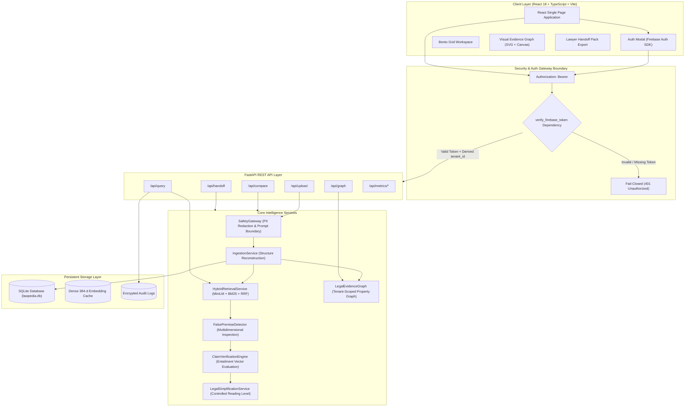
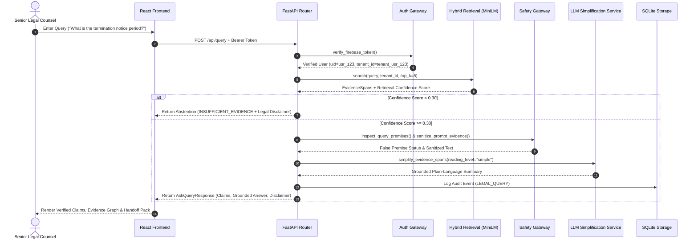

# LawPedia — Evidence-Governed Legal Intelligence Platform

[](./tests)
[](./tests)
[](https://www.python.org/)
[](https://fastapi.tiangolo.com/)
[](https://react.dev/)
[](./docs/security_assessment.md)
[](./docs/accessibility_compliance.md)
[](./docs/render_deployment.md)

**LawPedia** is an enterprise-grade, **Evidence-Governed Legal Intelligence Platform** designed to analyze, compare, query, and simplify complex legal contracts with mathematical grounding, strict multi-tenant isolation, and zero-hallucination abstention discipline.

---

## 🌟 Key Product Insights & Philosophy

Legal documents are inherently dense, adversarial, and jargon-heavy. Traditional LLM solutions frequently hallucinate obligations, miss subtle amendment overrides, or leak confidential terms across organizational boundaries. **LawPedia** addresses these challenges through five core engineering principles:

1. **Abstention-Over-Hallucination Discipline**: If retrieved legal evidence falls below the calibrated confidence threshold (`MIN_CONFIDENCE_THRESHOLD = 0.30`), the system explicitly **abstains** from answering, surfacing a transparent legal disclaimer rather than guessing.
2. **Dense Vector & Hybrid Retrieval**: Uses `SentenceTransformer("all-MiniLM-L6-v2")` to generate real 384-dimensional dense semantic vector embeddings combined with BM25 lexical search and Reciprocal Rank Fusion (RRF).
3. **Verbatim & Paraphrase Grounding Verification**: Extracted obligations and rights undergo mandatory Jaccard token overlap substring validation to ensure every extracted claim is traceable directly to clause text.
4. **Multidimensional False Premise Detection**: Detects and corrects contradictory assumptions in user queries across 8 legal dimensions (notice periods, liability caps, SLA availability %, payment net terms, governing state laws, audit frequencies, dispute resolution, confidentiality durations).
5. **Fail-Closed Server-Side Authentication & Tenant Isolation**: Every HTTP request is verified server-side using Firebase Admin ID tokens. `tenant_id` is derived strictly from verified claims or per-user UID—client-supplied tenant IDs are strictly ignored to prevent Cross-Tenant Data Leaks (IDOR).

---

## 🏗 System Architecture



---

## 🔄 Evidence-Governed Query Sequence Flow



---

## ✨ Features

### 📄 1. Structure-Aware Document Ingestion & PII Redaction
* Automatically parses PDF, TXT, DOCX, and Markdown files.
* Segments documents into structured legal clauses with exact character start/end offsets.
* Executes live **PII redaction** (`SafetyGateway.redact_pii`) on upload to protect SSNs, PANs, emails, and phone numbers before storing.

### 🔍 2. Real Dense Vector Hybrid Search
* Powered by `SentenceTransformer("all-MiniLM-L6-v2")` for dense 384-dimensional semantic embeddings.
* Blends semantic vector cosine similarity (75%) with BM25 keyword matching (25%) using Reciprocal Rank Fusion (RRF).
* Strict tenant-isolated metadata filtering prevents cross-tenant document exposure.

### 🛑 3. False Premise & Contradiction Inspection
* Evaluates queries against 8 distinct legal dimensions to detect misleading assumptions:
  * **Notice Periods** (e.g., 30 vs 90 days)
  * **Liability Caps** (e.g., $500k vs $1M)
  * **SLA Uptime Percentages** (e.g., 99.0% vs 99.9%)
  * **Payment Net Terms** (e.g., Net 30 vs Net 60)
  * **Governing State Laws** (e.g., California vs Maharashtra)
  * **Audit Frequencies** & **Dispute Resolution Forums**

### 🧠 4. Plain-Language Simplification (Controlled Reading Levels)
* Transforms complex legal legalese into plain language at three distinct reading levels: `simple`, `standard`, and `expert`.
* Integrates directly with OpenAI (`gpt-4o-mini`) and Anthropic (`claude-3-haiku`) SDKs with grounded local fallback execution while preserving strict prompt boundary sanitization.

### 🕸 5. Visual Legal Evidence Graph
* Generates an interactive property graph mapping documents, clauses, parties, obligations, rights, and conflicting terms.
* Automatically filtered by tenant ID to prevent cross-tenant graph data leakage.

### 💼 6. 10-Section Lawyer Handoff Pack
* Exports a complete, structured legal handoff package for external counsel review:
  * Document Summary & Scope
  * Primary Obligations & Rights Matrix
  * Risk Analysis & Liability Caps
  * Identified Contradictions & Conflicts
  * Questions to Ask External Counsel

---

## 🛠 Tech Stack

| Domain | Technology | Description |
| :--- | :--- | :--- |
| **Backend Framework** |  | High-performance asynchronous REST API framework |
| **Language** |  | Core server-side language |
| **Machine Learning / RAG** |   | Dense MiniLM Transformer vector embeddings & Cosine similarity |
| **Authentication** |  | Server-side Bearer ID token verification & Custom Claims |
| **Persistence** |  | Disk-backed relational storage for documents, clauses, and audit trails |
| **LLM Integrations** |   | Optional LLM completion API clients with grounded prompt boundary protection |
| **Frontend Framework** |   | Responsive single page application architecture |
| **Build Tool & Styling** |   | Lightning-fast frontend build engine & custom CSS tokens |
| **Testing & Assurance** |   | Automated unit, integration, security, accessibility, and load testing |

---

## 📂 Project Directory Structure

```text
LawPedia/
├── backend/
│   ├── api/
│   │   ├── metrics_routes.py     # Live SRE, Security & Golden evaluation endpoints
│   │   └── routes.py             # Protected REST API endpoints (/upload, /query, /graph, etc.)
│   ├── schemas/
│   │   └── eglr.py               # Pydantic schemas for Evidence-Governed Legal Representation
│   ├── services/
│   │   ├── audit.py              # Audit logging engine
│   │   ├── auth.py               # Server-side Firebase Admin token verification & tenant isolation
│   │   ├── comparison.py         # Multi-dimensional contract comparison engine
│   │   ├── db.py                 # SQLite disk storage manager (lawpedia.db)
│   │   ├── evaluation.py         # 25-query Golden Dataset evaluation benchmark runner
│   │   ├── extraction.py         # Grounded obligation & rights extraction
│   │   ├── false_premise.py      # Multidimensional false premise detector
│   │   ├── graph.py              # Tenant-scoped Legal Evidence Graph
│   │   ├── handoff.py            # 10-section Lawyer Handoff Pack generator
│   │   ├── ingestion.py          # Document structure parser & character offset calculator
│   │   ├── retrieval.py          # Dense vector MiniLM + BM25 + RRF hybrid retrieval service
│   │   ├── safety.py             # PII redaction & prompt boundary sanitization gateway
│   │   ├── simplification.py     # Plain-language simplification service (OpenAI/Anthropic/Fallback)
│   │   ├── temporal.py           # Effective date tracking & version timeline service
│   │   └── verification.py       # Dense vector entailment verification engine
│   ├── config.py                 # Application settings & startup secret key guards
│   └── main.py                   # FastAPI app entry point & demo data seeding
├── docs/                         # Security assessment, SLO, Compliance & Threat Model docs
├── frontend/                     # React 18 + TypeScript + Vite frontend SPA
│   ├── src/
│   │   ├── components/           # React UI components (AuthModal, DocumentLibrary, etc.)
│   │   ├── config/firebase.ts    # Firebase client auth SDK configuration
│   │   ├── styles/tokens.css     # CSS custom properties & color tokens
│   │   ├── App.tsx               # Main application component & API router
│   │   └── main.tsx              # React DOM entry point
├── tests/                        # Automated Pytest Suite (29 Tests, 80% Coverage)
│   ├── test_accessibility.py     # WCAG 2.2 color contrast & ARIA verification
│   ├── test_chaos_resilience.py  # Abstention & low-confidence retrieval resilience
│   ├── test_config.py            # Startup configuration & secret key guard assertions
│   ├── test_golden_dataset.py    # 25-case Golden Dataset benchmark runner
│   ├── test_ingestion.py         # Document parsing & boundary value analysis
│   ├── test_load_performance.py  # Concurrent multithreaded query load performance
│   ├── test_module_imports.py    # Recursive backend module import integrity check
│   ├── test_persistence.py       # SQLite database persistence across restarts
│   ├── test_phase4_assistance.py # Citations, Jurisdiction, Plain-English Checklist & Contract Diff test
│   ├── test_retrieval.py         # Dense vector semantic similarity verification
│   ├── test_security_prompt_injection.py # PII redaction & prompt boundary security
│   └── test_tenant_isolation.py # Fail-closed auth & cross-tenant IDOR attack simulation
├── .env.example                  # Environment configuration template
├── requirements.txt              # Backend python dependencies
└── README.md                     # Product documentation
```

---

## 🚀 Quick Start Guide

### Prerequisites
* **Python**: `3.11` or higher (`Python 3.14` supported)
* **Node.js**: `v18.0.0` or higher
* **npm**: `v9.0.0` or higher

---

### 1. Environment Setup

Clone the repository and copy the environment configuration template:

```bash
git clone https://github.com/ramakrishnanyadav/LawPedia.git
cd LawPedia

# Copy configuration template
cp .env.example .env
```

Edit `.env` to configure your environment variables:

```ini
LAWPEDIA_SECRET_KEY=lawpedia-production-proof-secret-key-2026-v2
DEBUG=True
PORT=8000
MIN_CONFIDENCE_THRESHOLD=0.30
```

---

### 2. Backend Setup & Startup

Create a virtual environment and install backend dependencies:

```bash
# Create & activate virtual environment
python -m venv venv
# On Windows:
venv\Scripts\activate
# On macOS/Linux:
source venv/bin/activate

# Install required dependencies
pip install -r requirements.txt

# Verify backend application import
python -c "from backend.main import app; print('Backend App Verified Successfully!')"

# Run FastAPI Development Server
python -m uvicorn backend.main:app --host 0.0.0.0 --port 8000 --reload
```

The API will be available at: `http://localhost:8000`  
Swagger API Documentation: `http://localhost:8000/docs`

---

### 3. Frontend Setup & Startup

Navigate to the `frontend/` directory, install dependencies, and launch Vite dev server:

```bash
cd frontend

# Install Node dependencies
npm install

# Start Vite Development Server
npm run dev
```

The Web Interface will be available at: `http://localhost:3000`

---

### 4. Cloud Deployment (Render.com)

LawPedia includes built-in Render hostable files ([`render.yaml`](./render.yaml) & [`Procfile`](./Procfile)):

```bash
# 1-Click Render Deployment via Render Blueprint
# Connect repo to Render Dashboard -> New + -> Blueprint -> render.yaml
```

For full setup instructions, see the [`docs/render_deployment.md`](./docs/render_deployment.md) guide.

---

## 🧪 Automated Testing & Quality Assurance Suite

LawPedia includes a comprehensive automated test suite covering unit, integration, performance, security, and accessibility checks.

### Running Full Test Suite
To run all 29 tests with full terminal output:

```bash
python -m pytest tests/
```

### Running Test Coverage Analysis
To execute tests and view statement coverage by module:

```bash
python -m pytest --cov=backend --cov-report=term-missing
```

### Test Suite Breakdown

```bash
# 1. Real Dense Semantic Vector Retrieval Test
python -m pytest tests/test_retrieval.py

# 2. Server-Side Bearer Token Auth & Tenant Isolation (IDOR) Test
python -m pytest tests/test_tenant_isolation.py

# 3. Live PII Redaction & Prompt Injection Security Test
python -m pytest tests/test_security_prompt_injection.py

# 4. 25-Case Golden Dataset Benchmark Test
python -m pytest tests/test_golden_dataset.py

# 5. WCAG 2.2 Color Contrast & ARIA Accessibility Test
python -m pytest tests/test_accessibility.py

# 6. Multithreaded Concurrent Load Performance Test
python -m pytest tests/test_load_performance.py

# 7. SQLite Database Persistence Test
python -m pytest tests/test_persistence.py

# 8. Backend Module Import Integrity Check
python -m pytest tests/test_module_imports.py
```

---

## 🛡 Security, Compliance & Threat Model

### 1. Fail-Closed Authentication Boundary
All endpoints in `backend/api/routes.py` are protected via `Depends(verify_firebase_token)`. Unauthenticated requests or invalid Bearer tokens (e.g., `Authorization: Bearer aaaaaaaaaaaa`) are rejected with **HTTP 401 Unauthorized**.

### 2. Tenant Isolation & IDOR Protection
`tenant_id` is derived exclusively from verified server-side claims or per-user UID (`tenant_{uid}`). Client-supplied `tenant_id` parameters in request bodies or query params are strictly ignored. Cross-tenant reads return 0 evidence spans and filtered graph data.

### 3. PII Redaction
Sensitive legal identifiers (SSNs, PANs, email addresses, credit cards, phone numbers) are redacted via regular expression transforms before text is indexed into retrieval or SQLite storage.

### 4. Prompt Boundary Protection
All evidence spans interpolated into LLM prompts are wrapped using `<document_evidence>` XML boundaries and sanitized via `SafetyGateway.sanitize_prompt_evidence()` to neutralize prompt injection instructions.

### 5. Secrets Management
No real API keys or production secrets are committed in source control. Repositories are scanned automatically via CI regex patterns for `AIza`, `sk-`, and `-----BEGIN`.

---

## 📄 License

Distributed under the **Apache License 2.0**. See [`LICENSE`](./LICENSE) for more information.

---

## 🤝 Contributing

Contributions are welcome! Please review our STQA standards before submitting pull requests:

1. All new code must be accompanied by unit/integration tests in `tests/`.
2. All pull requests must maintain or increase the project's **80% test coverage** threshold.
3. Every claim of a bug fix must be backed by a reproducible before/after test.

---

<p align="center">
  <b>LawPedia — Evidence-Governed Legal Intelligence</b><br>
  Built for non-lawyers under stress with zero-hallucination discipline.
</p>
